🎨Ecommerce_PalleteBay
* PalleteBay is a full-stack e-commerce platform designed to sell beautiful paintings online. 
* It supports user authentication via Google, allows users to browse products, add them to the cart, save addresses, and place orders. 
* Built using modern web technologies and follows MVC and modular architecture principles.
  
-----------------------------------------------------------------------------------------------------------------------------------------------------------------------------
💡Tech Stack Used -

Frontend:
* HTML, CSS, and JavaScript
  The static and interactive client-side components are located in the `PalleteBay/FrameHue/public` and `views` folders.

Backend:
* Node.js with Express.js
  Manages API routes, session handling, authentication, and order logic.

Database:
* MongoDB with Mongoose
  Stores user data, orders, and shipping addresses.

Authentication:
* Passport.js for middleware authentication
* Google OAuth (`passport-google-oauth20`) for login
* `express-session` for managing login sessions

Environment:
*Environment variables are stored in `.env.demo` and loaded via `dotenv`

-----------------------------------------------------------------------------------------------------------------------------------------------------------------------------
📁 Folder & File Overview

Top-Level Files and Folders:
* `.env.demo`
  Contains required environment variable keys like OAuth credentials, session secrets, and MongoDB connection string.
* `.gitignore`
  Prevents sensitive and bulky files (like `.env`, `node_modules`) from being committed to Git.
* `.vscode/`
  Editor-specific settings (helpful for team collaboration using VS Code).
* `package.json` & `package-lock.json`
  Define Node.js project metadata, dependencies, and scripts.
* `package.json` tells others what libraries your project depends on, and `package-lock.json` ensures consistent installs.

---

`PalleteBay/FrameHue/` Folder:
* `backend/`
  Contains backend Mongoose models:
* `address.js`: Manages user address data (country, city, pincode, etc.).
* `order.js`: Manages user orders (items in the cart, payment methods, shipping address, user ID).
 These models enforce data structure and relations in MongoDB using Mongoose schemas.

* `public/`
  Contains static assets like custom stylesheets and frontend scripts.
* `views/`
  HTML templates rendered by the server and sent to the browser (products, checkout, etc.).

---

Root-Level Backend Files:
* `server.js`
  Main application file:
  * Sets up the Express server
  * Connects to MongoDB (via `MONGO_URI` from `.env.demo`)
  * Configures middleware for sessions and JSON parsing
  * Handles all API routes (checkout, user data, order management, address management)
  * Sets up static file serving and route protection via middleware
* `auth.js`
  Initializes Google OAuth via Passport.js
  Sets up Google login flow and serializes user sessions
* `user.js`
  Manages user schema (if used separately from `auth.js`) or supports user-related DB logic

------------------------------------------------------------------------------------------------------------------------------------------------------------------------------

🚀 Getting Started - How to start the project?

1. Download the zip file or Clone the Repository:
```
git clone https://github.com/PoojithaBonela/Ecommerce_PalleteBay.git
cd Ecommerce_PalleteBay-master
```

2. Install Node.js Dependencies inside the folder:
```
npm install
```

3. Make Sure MongoDB Is Running:
* Either install MongoDB locally or use MongoDB Atlas (cloud database).
* The app connects to `mongodb://localhost:27017/framehue` by default, and uses real Google OAuth Credentials for testing purposes only, you're good to go with .env.demo.

4. If you want to use your own MongoDB and Google OAuth credentials Update `.env.demo`:
* Open `.env.demo`
* Replace the values with your own:
```
MONGO_URI=your_own_mongodb_connection_string
SESSION_SECRET=any_random_secure_string
GOOGLE_CLIENT_ID=your_google_client_id
GOOGLE_CLIENT_SECRET=your_google_client_secret
GOOGLE_CALLBACK_URL=http://localhost:3000/auth/google/callback
```

5. Run the Server:
```
node server.js
```
or if using `npm start` in `package.json`:
```
npm start
```

6. Open the App:
   Visit `http://localhost:3000` in your browser.
-----------------------------------------------------------------------------------------------------------------------------------------------------------------------------
📌 Features
🏠 Homepage
Clean landing section displaying paintings and promotions.
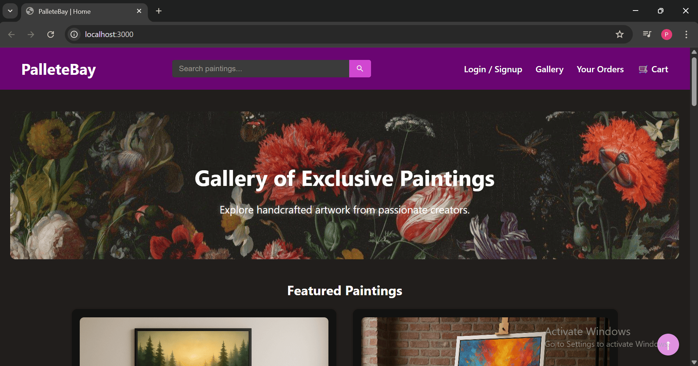
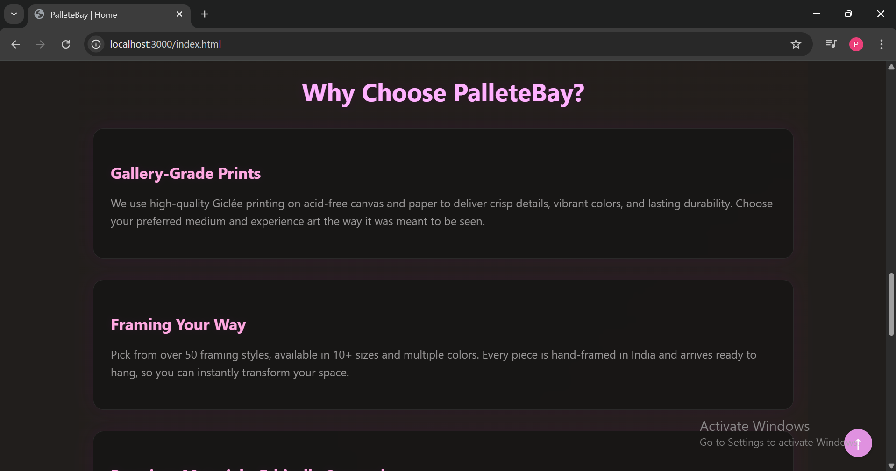
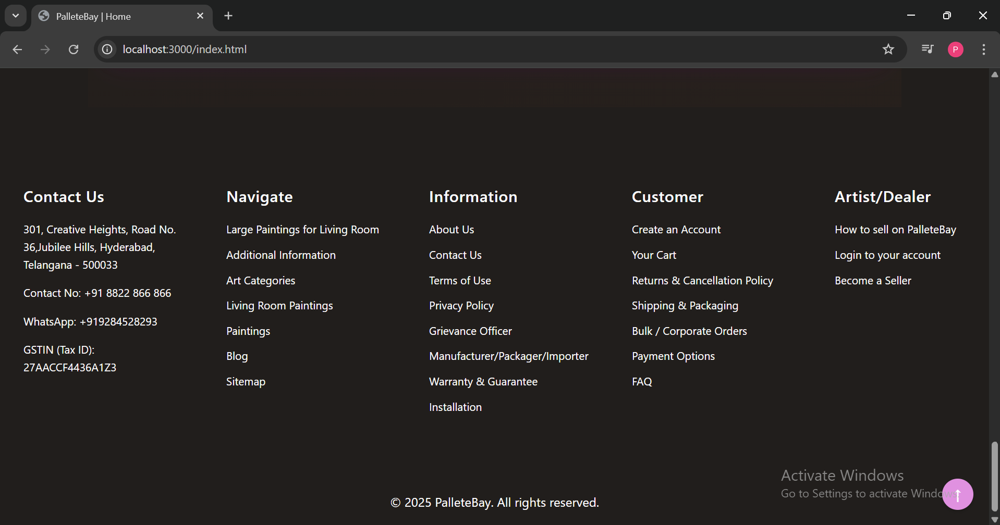

-------------------------------------------------------------

🔐 Login with Google  
Secure login via Google OAuth using Passport.js.  
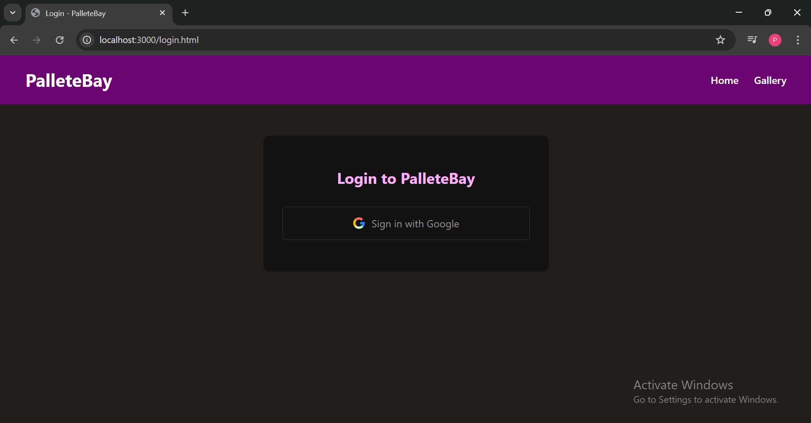  


-------------------------------------------------------------

🛍️ Product Gallery  
Visually rich product cards with quick access to details.  
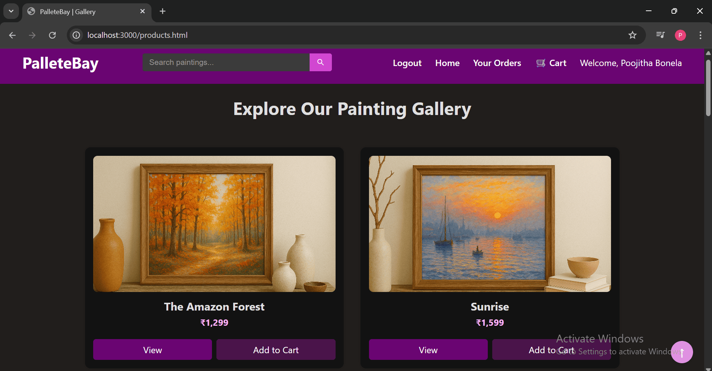

-------------------------------------------------------------

📦 Product Detail Page  
Each product has a dedicated page with detailed description and “Add to Cart” functionality.  
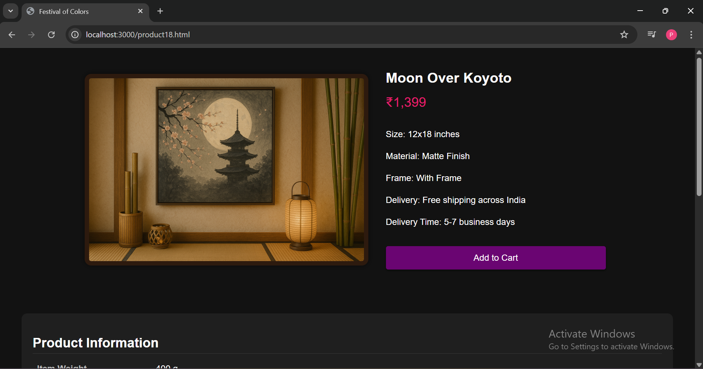

-------------------------------------------------------------

🛒 Shopping Cart  
Displays products added to cart, with price and quantity.  
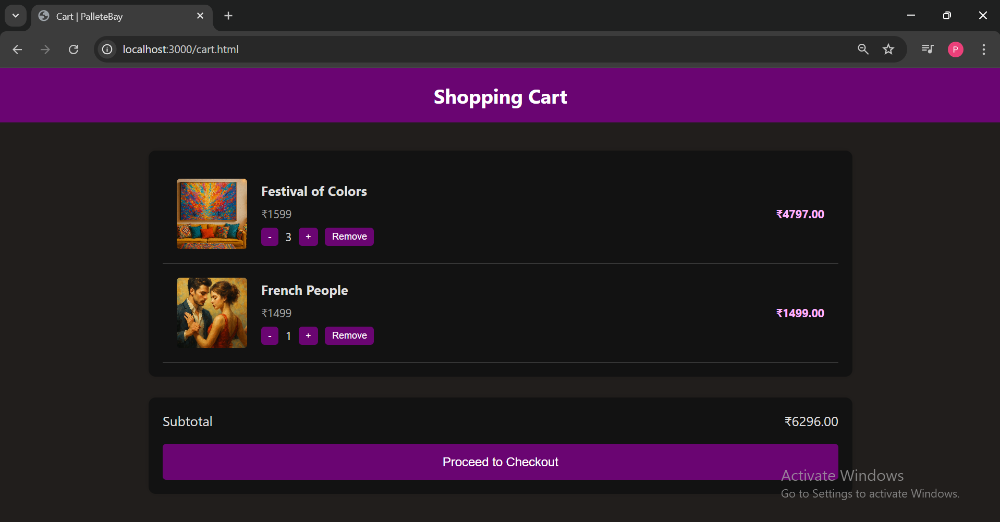

-------------------------------------------------------------

🏁 Checkout Flow  
Includes add address → address selection → payment → order confirmation.  
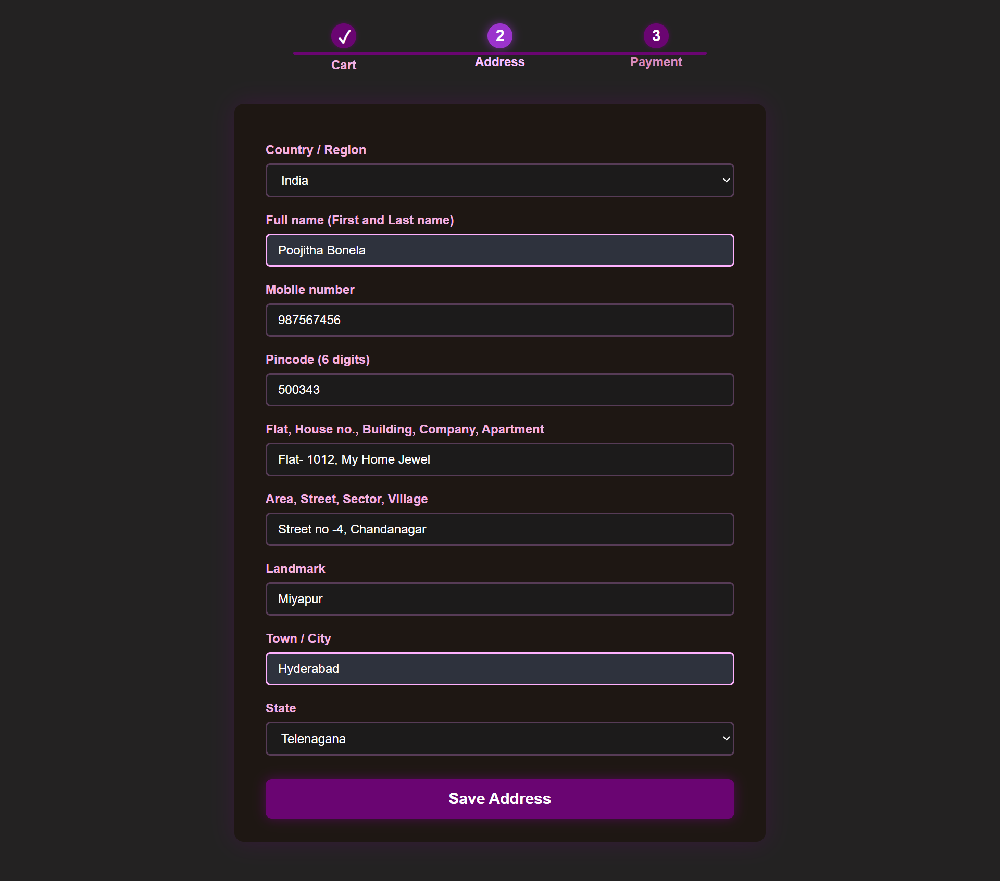  
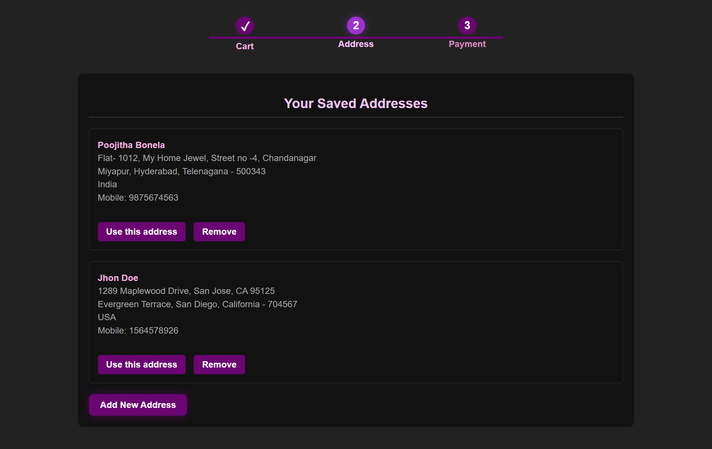  
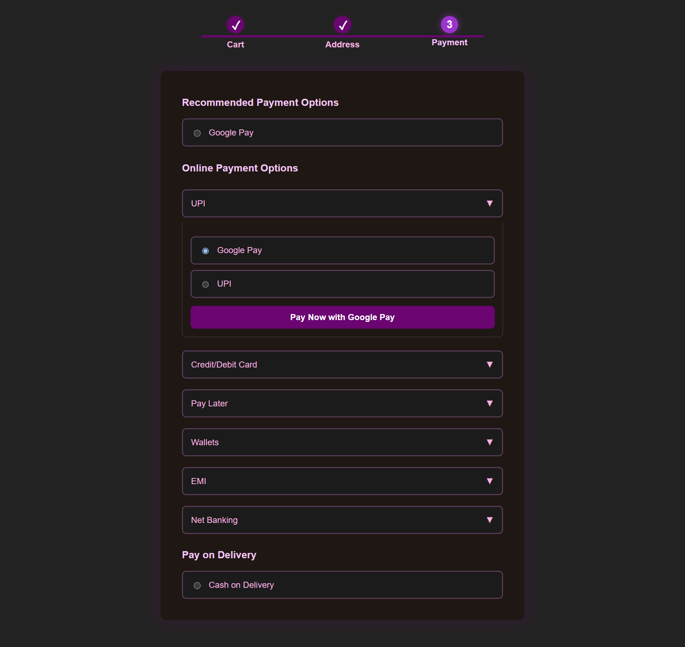
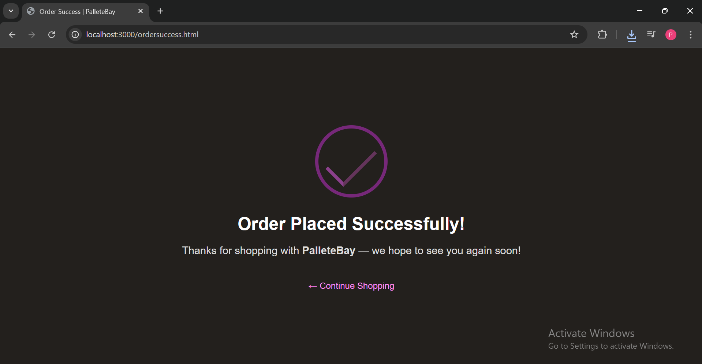

-------------------------------------------------------------

📋 Order History  
Users can view their past orders and details.  
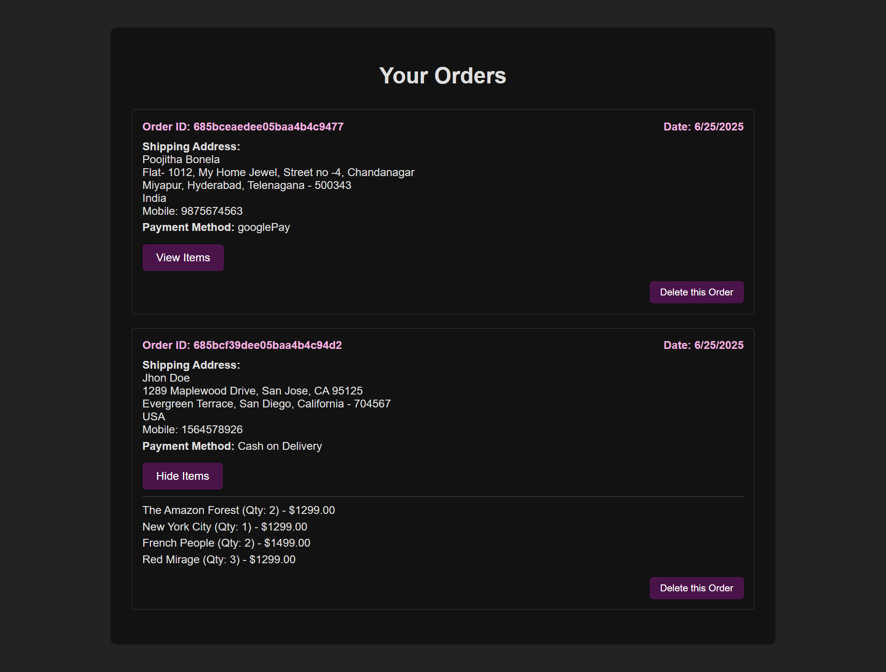


